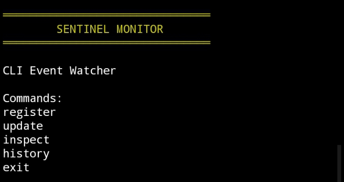

# 🟡 SENTINEL MONITOR



A lightweight real-time CLI event tracker built on Intercom architecture.

Sentinel Monitor provides structured monitoring, event updates, and contract inspection
through a clean command-line interface.

Trac Address : trac1z6s549jnqffe4tf60mzq9kprj6lc09037f3fgrv9mwrjp8h0z28sjsq2g2

---

## ✨ Features

- Real-time event registration  
- Event update system  
- Detailed inspection view  
- Historical tracking  
- Lightweight CLI engine  
- Clean yellow futuristic interface  

---

## 🚀 Installation

```bash
git clone https://github.com/DennyArdy/sentinel.git
cd sentinel
npm install
node index.js
```
---


